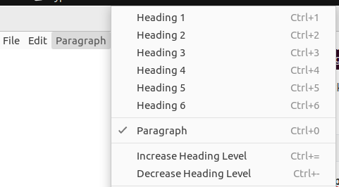

# How to Write README.md file using Typora .

### 1. Install Typora 

#### 1.1. On Linux OS:

- open the terminal by **CTRL+ALT+T** and write this command:

```
# First add Typora's external repository to your system's list of package sources.

sudo add-apt-repository 'deb https://typora.io/linux ./'
sudo apt-get update

# Then install typora
sudo apt-get install typora
```

> Hint: This command will ask you for your user password.

But you **may** face this error:


- Solve this issue by use ***snap*** package manager instead of ***apt***  [SOLVED] 

```
sudo snap install typora
```

then the **snap** will download **typora** and install it.


#### 1.2. On Windows OS:

- Go to the typora Website [clickHere](https://typora.io/) , download your suitable version (Win 64bit or 32bit) and install it.

  


### 2. Open typora 

- write ***typora*** on the terminal to open the application in case of Linux OS.

```
typora
```


> From Here In case of Linux or Windows OS.

#### 2.1. Heading 

- You can select the font heading from **paragraph** in the tool-par as follow :



Or use a number of (# )signs before of a word or phrase. Take care about the space after # sign. 

[# anyWord : Heading 1]

[## anyWord : Heading 2], and so on...etc.

- # Heading 1 (# )

- ## Heading 2       (## )

- ### Heading 3           (### )

- #### Heading 4                 (#### )

- ##### Heading 5                          (##### )

- ###### Heading 6                          (###### )

#### 2.2. Tables 

- You can select **Table** from **paragraph** in the tool-par as follow


- Then select **Insert Table** and determine the number of columns and rows as you want.


| **Column 1 , Row 1** | **Column 2 , Row 1** | **Column 3 , Row 1** |
| :------------------: | :------------------: | :------------------: |
| **Column 1 , Row 2** | **Column 2 , Row 2** | **Column 3 , Row 2** |
| **Column 1 , Row 3** | **Column 2 , Row 3** | **Column 3, Row 3**  |
| **Column 1 , Row 4** | **Column 2 , Row 4** | **Column 3 , Row 4** |

#### 2.3. Code Fences

```
# The area which you can write a certain command or code,as the example below
```

```
sudo apt install python3-pip
```

- Another example:

```c
#include <stdio.h>
int main(void)
{
    printf("This is an example of Code Fences ! \n");
}
```
- You can select the Programming Language as you like 

- you can select **Code Fences** from **paragraph** in the tool-par as follow: 


#### 2.4.  List

##### 2.4.1. Ordered List 

Arrange some of points by order like that:

1. First Point.
2. Second Point.
3. Third Point.     

##### 2.4.2. Unordered List

- First Point.
- Second Point.
- Third Point. 

##### 2.4.3. Task List

- [x] Task 1 Done.
- [x] Task 2 Done.
- [ ] Task 3 Done.

##### 2.4.4. List Indentation

- First Point.

  - First Part of First Point.
  - Second Part of First Point.
  - Third Part of First Point.

  You can Select those options from **paragraph** in the tool-par as follow:


#### 2.5. Quote

> This is a form of Quote, you can write anything here to notify the reader for anything you want.
>
> Note that, In my opinion there is not only specific way to make a professional README.md file, But definitely the the most mistake is not include your README.md file with your project.

You can Select Quote option from **paragraph** in the tool-par as follow:


OR You can use right arrow sign (>) before the sentences.

#### 2.6. Hyper Links

- The syntax of create hyper-link as follow:

  
- Example:  [MyLinkedInAccount](https://www.linkedin.com/in/anas-khamees12/)  
  
  
- Or you can Select Hyper Link option from **Format** in the tool-par as follow:


#### 2.7. Insert Images

> There are many methods to insert images to README.md file, also you can drag the images and drop them on the Github server directly by Select **Edit file** and drop the image in any position in the file.
> **This is the easiest way**
> 


- #### Insert the images using Typora

  - Select **File** from the tool-bars then select **Preferences** 


  - Select **Image**, then change the ***When Insert Images*** option to: **Copy image to ./${filename}.assets**


    > **Copy image to ./${filename}.assets** option creates folder automatically called ***README.assets***    to save the all images used in README.md file, this assets folder is uploaded with the Repo to provide Github server with images source.

    


  - If you forget to select **Copy image to ./${filename}.assets**  option and added the images already, Don't worry :

    > Select the image and Right Click on it, then select this option: **Copy to README.assets**.
    >
    > This Option copies The images to **README.assets** folder automatically.
    


  - Finally  Select **Image** then **Insert Image** option from **Format** in the tool-par as follow:
  


  - Click on the URL icon to select your Image as follow: 

  


TO BE CONTINUED   . . . . . . . . . . .
